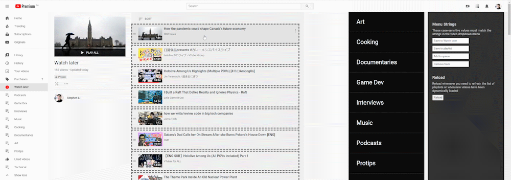

# YouTube Playlist Organizer



I add a lot of YouTube videos to my Watch Later list throughout the week and binge them on the weekends. I generally like to watch videos that fall under the same topics together (e.g. all art videos, all music videos, etc.). Currently, it is very tedious to move videos in my Watch Later list into other playlists. I created this Userscript to help me organize my Watch Later list (as well as any other playlists):

Action | Default Web UI | YouTube Playlist Organizer
--- | -- | ---
Move to another playlist | 5 Clicks  | 1 Drag
Add to Watch Later<br>(from a normal playlist) | 2 clicks | 1 Drag
Add to Queue | 2 Clicks | 1 Drag
Remove from List | 2 Clicks | 1 Drag

### Why Userscript instead of YouTube API

As of [2016](https://developers.google.com/youtube/v3/revision_history#september-15-2016), the Watch Later list has been depricated from YouTube's API. As a result, the only way to programatically make changes to the Watch Later list is by directly emulating user actions on the website.

### Disclaimer

This tool relies on timers and jQuery selectors to find playlists and videos on the page. Random input/UI lag may break script. In addition, this tool *will* stop working whenever YouTube's markup changes.

# Installation Guide

1. Install a Userscript manager for your web browser
    * [Greasemonkey](https://addons.mozilla.org/en-US/firefox/addon/greasemonkey/) (Firefox)
    * [Tampermonkey](https://www.tampermonkey.net/) (Chrome, Firefox, Safari, Edge)

2. [Download the latest build](https://github.com/Trinovantes/userscript-youtube-playlist-organizer/releases/download/latest/userscript-youtube-playlist-organizer.user.js). If you have Greasemonkey or Tampermonkey installed, then you should immediately be prompted with a confirmation window asking you if you wish to install this Userscript.

# Dev Guide

1. Install prereq

    * `node`
    * `yarn`
    * Tampermonkey on Chrome

2. In Chrome:
    
    * Go to `chrome://extensions/`
    * Go into Tampermonkey's details
    * Enable `Allow access to file URLs`

3. Run dev server

    ```
    yarn install
    yarn dev
    ```

4. In Tampermonkey options:

    * Go to `Utilities` tab
    * Install from URL: `http://localhost:8080/userscript-youtube-playlist-organizer.meta.js`
    * Go to `Installed Userscripts` tab
    * Open the recently installed script and add this line (change the path accordingly) inside the config headers.

        ```
        // @require file:///path\to\dist\userscript-youtube-playlist-organizer.user.js
        ```
